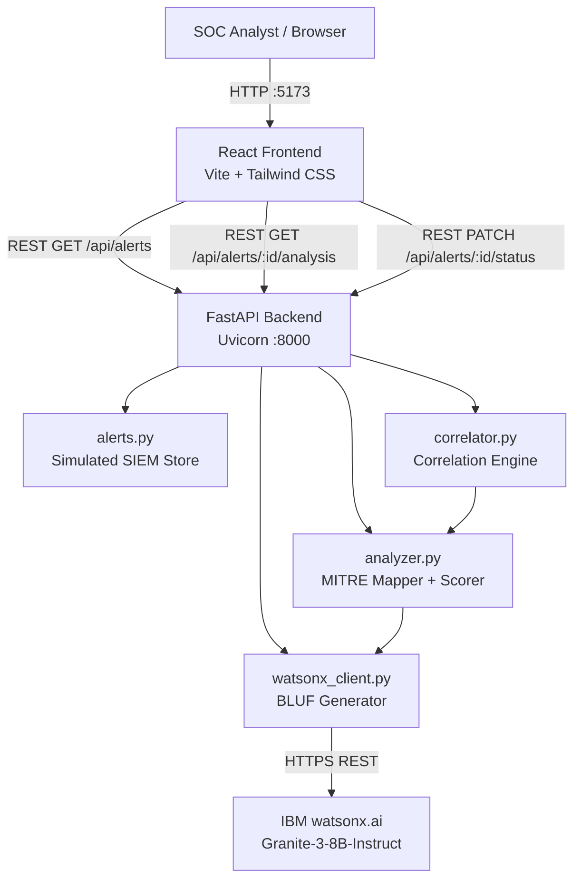

# Architecture

## System Architecture

## Components

| Component | Technology | Responsibility |
|---|---|---|
| Frontend | React 18, TypeScript, Tailwind CSS, Vite | SOC dashboard UI — alert list, filters, detail panel |
| Backend API | FastAPI 0.115, Python 3.11 | REST endpoints, orchestration of analysis pipeline |
| Alert Store | In-memory Python list (`alerts.py`) | 50 simulated SIEM alerts covering 8 attack scenario types |
| Correlation Engine | `correlator.py` | Groups alerts by shared source IP, destination subnet, type and time window |
| Analysis Engine | `analyzer.py` | Risk scoring (0–100), MITRE ATT&CK mapping, classification, recommended actions |
| BLUF Generator | `watsonx_client.py` | IBM watsonx.ai Granite inference; rule-based fallback when no API key |
| IBM watsonx.ai | Granite-3-8B-Instruct model | Natural language BLUF threat summary generation |

## Data Flow

1. **On page load**, the React frontend calls `GET /api/alerts`. The backend returns all 50 simulated alerts with ID, source, timestamp, IPs, alert type, severity, and status.
2. **Filter/search** operations happen client-side in React state — no additional API calls.
3. **Alert selection**: analyst clicks an alert row. The frontend calls `GET /api/alerts/{alert_id}/analysis`.
4. The backend `correlator.py` scans the in-memory store and builds a *correlated cluster* (related alerts sharing source IP, destination network, or alert type within ±60 minutes).
5. `analyzer.py` computes the 0–100 risk score from severity, cluster size, MITRE technique count, and asset criticality. It assigns a classification and recommended actions.
6. `watsonx_client.py` constructs a structured prompt and calls `POST /ml/v1/text/generation` on IBM watsonx.ai. The generated BLUF text is returned. On timeout or missing key, a deterministic rule-based summary is used.
7. The combined analysis object is returned to the frontend and rendered in the `AlertDetail` panel.
8. **Status updates**: analyst clicks a status button → `PATCH /api/alerts/{alert_id}/status` updates the in-memory store.

## API Endpoints

| Method | Path | Description |
|---|---|---|
| `GET` | `/api/alerts` | List all alerts (id, source, timestamp, src_ip, dst_ip, type, severity, status) |
| `GET` | `/api/alerts/{id}/analysis` | Full analysis: correlation, risk score, MITRE, classification, BLUF, recommendations |
| `PATCH` | `/api/alerts/{id}/status` | Update alert status (open / in_review / closed) |
| `GET` | `/api/stats` | Summary counts: total, HIGH, MEDIUM, LOW, open, closed |
| `GET` | `/health` | Health check — returns `{"status": "ok"}` |

## Security Considerations

- API keys and secrets are stored in environment variables via `.env` — never committed to git (`.gitignore` covers `.env`).
- The `.env.example` file contains only placeholder values — safe to commit.
- CORS is configured in FastAPI to allow only `http://localhost:5173` in development. A real deployment would restrict this to the known frontend origin.
- No user authentication is implemented (hackathon prototype — not production-ready).
- All alert data is synthetic — no real IP addresses, hostnames, or user data.

## Scalability Notes

The FastAPI backend is stateless and horizontally scalable. For production:

- Replace the in-memory alert store with a PostgreSQL or Elasticsearch backend (typical SIEM data store).
- Add a message queue (e.g., IBM MQ or Kafka) to decouple alert ingestion from analysis.
- Cache watsonx.ai BLUF responses by alert cluster fingerprint to reduce API calls.
- Add a WebSocket channel so the dashboard receives new alerts in real time without polling.
